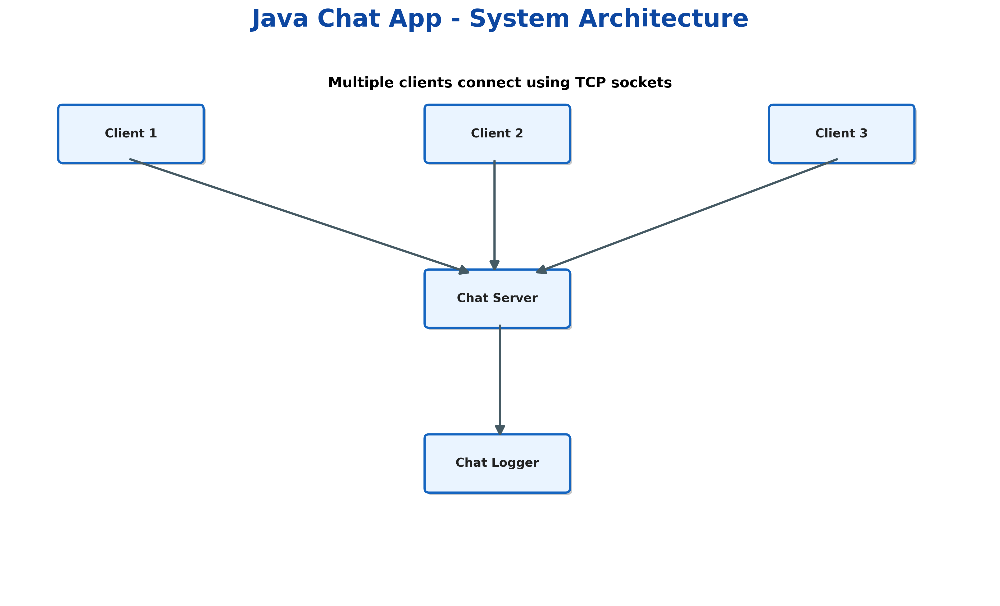
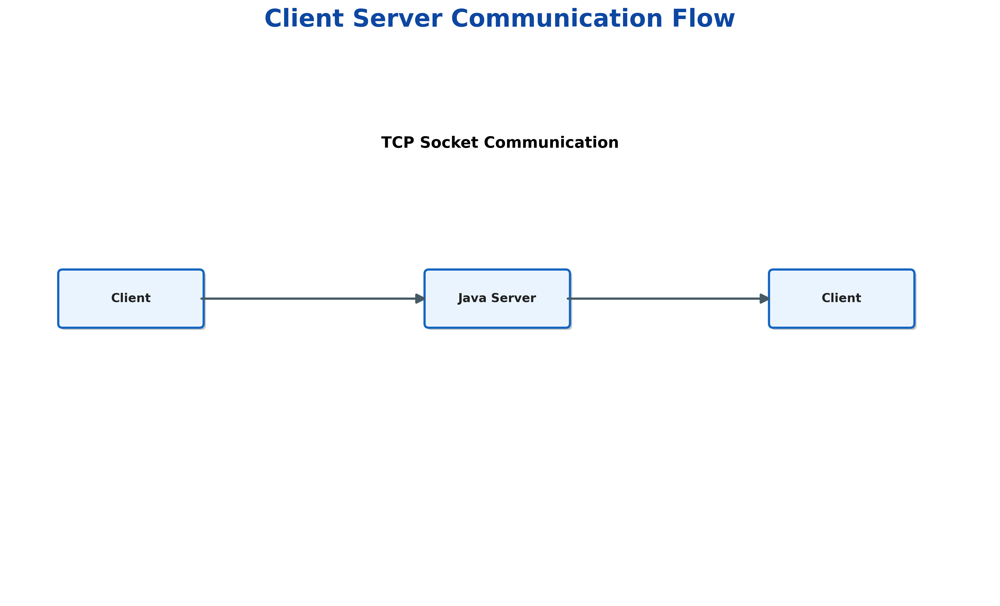
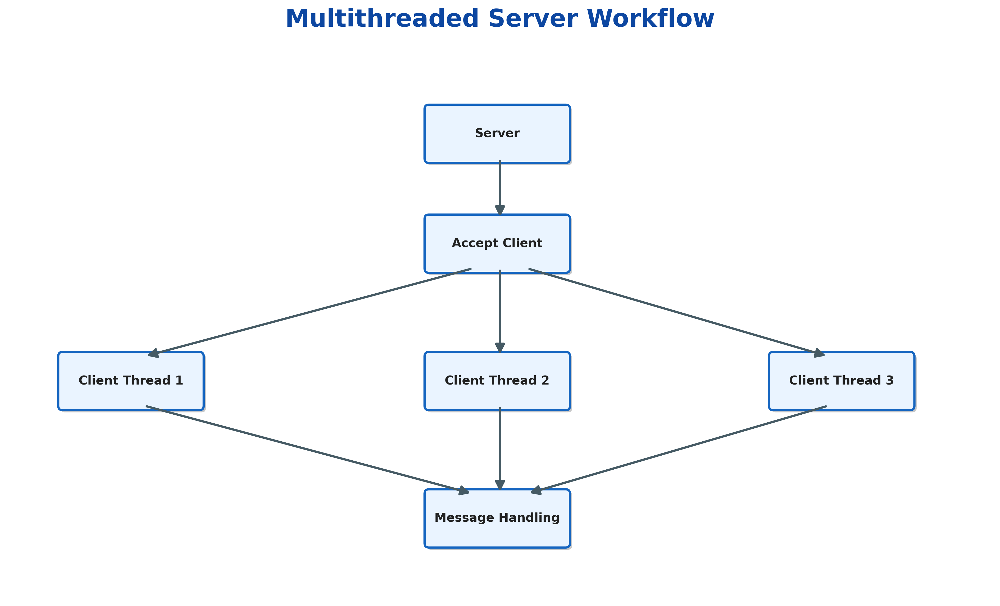
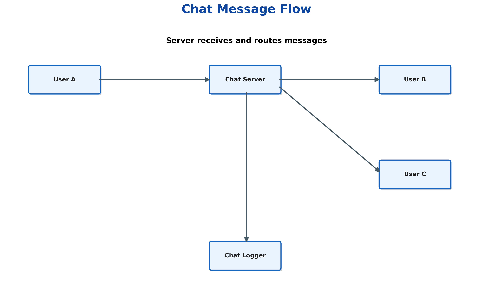

# Java Chat App with Socket Programming 🚀

A real-time multi-client chat application built using **Java Socket Programming and Multithreading**.

This project demonstrates how client-server communication works using TCP sockets, how multiple users can connect simultaneously, and how a server manages concurrent communication using dedicated client handler threads.

---

# 📌 Project Overview

Modern applications such as messaging platforms, collaboration tools, multiplayer games, and real-time support systems rely on network communication.

This project implements a simplified real-time chat system where:

- Multiple clients connect to a central server
- Users enter unique usernames
- Messages are exchanged instantly
- The server manages multiple users concurrently
- Chat activities are stored using logging

The project focuses on understanding the fundamentals of:

- Network programming
- TCP communication
- Client-server architecture
- Multithreading
- Concurrent programming
- Java I/O handling

---

# 🎯 Objectives

The main objectives of this project are:

- Build a real-time chat application using Java
- Understand socket-based communication
- Implement a multi-client server
- Handle multiple connections using threads
- Learn message broadcasting techniques
- Practice Java networking concepts
- Create an industry-oriented backend project

---

# 🏗️ System Architecture



The application follows a client-server architecture:

```
Client 1
   |
Client 2
   |
Client 3
   |
TCP Socket Connection
   |
Java Chat Server
   |
Client Handler Threads
   |
Message Processing
   |
Chat Logger
```

---

# 🔄 Communication Flow



Workflow:

1. Client starts the application
2. Client establishes TCP connection with server
3. Server accepts connection using ServerSocket
4. A separate ClientHandler thread is created
5. User sends messages
6. Server processes and broadcasts messages
7. Connected users receive messages in real time

---

# 🧵 Multithreading Workflow



Each connected user is handled independently.

Example:

```
Main Server Thread

        |
        |
Accept Client

        |
        |
Create ClientHandler Thread


Client 1  ---> Thread 1
Client 2  ---> Thread 2
Client 3  ---> Thread 3
```

Benefits:

- Multiple users can communicate simultaneously
- One client does not block others
- Better resource management
- Real-time communication support

---

# 💬 Message Flow

This diagram explains how messages travel through the Java Chat Server between multiple clients.



Example:

```
Client A
   |
   |  Sends Message
   |
   ▼
Java Chat Server
   |
   |  Processes & Routes Message
   |
   ├──────────────► Client B
   |
   └──────────────► Client C
```

The Java Chat Server acts as the central communication manager. It receives messages from clients, processes them, and forwards them to the appropriate connected users.

This demonstrates:

- Real-time message transmission
- Server-side message routing
- Multi-client communication
- Centralized chat management
---

# 🛠️ Technologies Used

| Technology | Purpose |
|---|---|
| Java 21 | Programming Language |
| Socket Programming | Network Communication |
| TCP Protocol | Reliable Data Transfer |
| Multithreading | Multiple Client Handling |
| Java I/O | Reading and Writing Data |
| File Handling | Chat Logging |
| VS Code | Development Environment |

---

# 🧩 Java Concepts Implemented

## Socket

Used to create communication endpoints between clients and server.

## ServerSocket

Allows the server to listen for incoming client connections.

## Threads

Each client connection runs on an independent thread.

## InputStream / OutputStream

Used for transferring data between client and server.

## BufferedReader

Reads incoming messages efficiently.

## PrintWriter

Sends messages to connected clients.

## Exception Handling

Handles connection failures and unexpected errors.

## Object-Oriented Programming

Project is divided into multiple reusable classes.

---

# ✨ Features

## Core Features

✅ TCP Socket Communication  
✅ Client-Server Architecture  
✅ Multiple Client Support  
✅ Real-Time Messaging  
✅ Username Registration  
✅ Join Notifications  
✅ Leave Notifications  
✅ Multithreaded Server  
✅ Chat History Logging  
✅ Graceful Disconnect Handling  


## Future Features

🔹 GUI using Java Swing/JavaFX  
🔹 User Authentication  
🔹 Database Integration  
🔹 Multiple Chat Rooms  
🔹 File Sharing  
🔹 Message Encryption  
🔹 Online/Offline Status  

---

# 📂 Project Structure

```
Java-Chat-App-Socket-Programming/

│
├── src/
│
│   ├── server/
│   │   ├── ChatServer.java
│   │   ├── ClientHandler.java
│   │   └── ChatLogger.java
│
│   ├── client/
│   │   └── ChatClient.java
│
│   └── common/
│       └── Message.java
│
├── images/
│   ├── system_architecture.png
│   ├── client_server_flow.png
│   ├── thread_workflow.png
│   ├── message_sequence.png
│   └── project_workflow.png
│
├── logs/
│   └── chat_history.log
│
├── README.md
├── .gitignore
└── LICENSE
```

---

# ⚙️ Installation & Setup

## Requirements

Install:

- Java JDK 21 or above
- VS Code / IntelliJ IDEA
- Git


Check Java installation:

```bash
java -version
```

Check compiler:

```bash
javac -version
```

---

# ▶️ Running the Project

## Step 1: Compile

From the project folder:

```bash
javac -d bin src/server/*.java src/client/*.java src/common/*.java
```

---

## Step 2: Start Server

Open Terminal 1:

```bash
java -cp bin server.ChatServer
```

Output:

```
====================================
 Java Chat Server Started
 Listening on port: 5000
====================================
```

---

## Step 3: Start Client

Open Terminal 2:

```bash
java -cp bin client.ChatClient
```

Enter username:

```
Ananya
```

---

## Step 4: Connect Another Client

Open Terminal 3:

```bash
java -cp bin client.ChatClient
```

Enter:

```
Rahul
```

Now both clients can communicate.

---

# 🧪 Sample Output

Server:

```
Java Chat Server Started
Listening on port: 5000

Ananya joined the chat
Rahul joined the chat
```

Client:

```
Connected to Chat Server

Ananya:
Hello Rahul

Rahul:
Hello Ananya
```

---

# 📝 Chat Logging

All chat activities are stored in:

```
logs/chat_history.log
```

Example:

```
[12:30:10] Ananya joined the chat

[12:31:05] Ananya:
Hello Everyone
```

---

# 🧪 Testing Performed

| Test Case | Result |
|---|---|
| Single client connection | Passed |
| Multiple clients | Passed |
| Message broadcasting | Passed |
| Client disconnect handling | Passed |
| Server communication | Passed |
| Chat logging | Passed |

---

# 🌍 Industry Relevance

This project represents the fundamentals behind:

- Messaging applications
- Customer support platforms
- Multiplayer games
- Collaboration systems
- Real-time notification services
- Distributed applications

Although modern applications use advanced frameworks, the core concepts remain:

- Network communication
- Concurrent processing
- Data transfer
- Backend architecture

---

# 📚 Learning Outcomes

Through this project, I learned:

- How TCP sockets work
- How client-server systems communicate
- How servers handle multiple users
- How multithreading enables concurrency
- How Java networking APIs are used
- How backend communication systems are designed

---

# 👩‍💻 Author

**Ananya Jain**

---

# 📄 License

This project is licensed under the MIT License.
